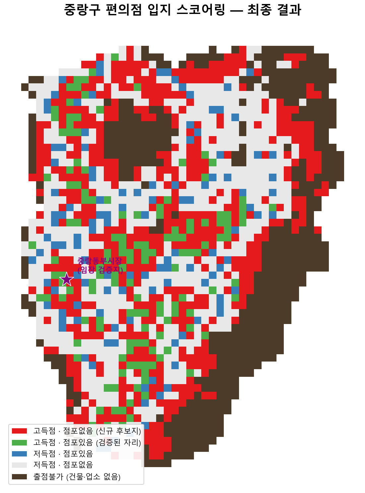

# 편의점 최적입지 스코어링 및 검증 (서울시 중랑구 기준)

서울 전체 상권·유동인구 공공데이터로 편의점 매출 결정 요인을 학습하고, 중랑구를 100m 격자 단위로 스코어링해 출점 후보지를 도출한 뒤, **실제로 5곳을 직접 답사해 모델을 검증**한 개인 포트폴리오 프로젝트입니다.



*빨강 = 고득점·점포없음(신규 후보지), 초록 = 고득점·점포있음(검증된 자리), 파랑 = 저득점·점포있음, 회색 = 저득점·점포없음, 갈색 = 출점불가(건물·상가 없음 — 도로·하천·산지 등). 인터랙티브 버전: [outputs/30_jungnang_map_final_v4.html](outputs/30_jungnang_map_final_v4.html)*

## 문제 정의 및 배경

**"편의점이 잘되는 자리의 조건을 데이터로 찾고, 현장에서 검증한다."**

입지 분석 및 선정에서는 늘 가중치를 결정하는 것이 중요한 과제입니다. 이 프로젝트는 그 과제를 "가중치를 데이터로 직접 학습"하는 방식으로 해결해보고자 시작된 것입니다. 서울 전체 편의점 매출 데이터로 LightGBM 모델을 학습하고, 그 모델을 중랑구 100m 격자에 적용해 점수화한 뒤, 점수 × 기존 점포 유무 4분면 분석과 실제 현장 답사(임장)로 결과를 검증합니다.

## 핵심 결과 요약

- 서울시 편의점 9,407개(정제 후) 기준, 상권 708개에 대해 LightGBM 매출 예측 모델을 학습했습니다.
- 절대 매출액 예측력(R²)은 높지 않지만, 이 프로젝트의 실제 목적인 **순위 기반 스코어링**에서는 테스트셋 스피어만 순위상관 0.312, 실제 매출 상위 20% 상권 중 46.4%를 모델도 상위 20%로 짚어내는 적중률을 확인했습니다.
- 중랑구 100m 격자 1,858개를 스코어링하고, **건물+상가 존재 여부로 물리적으로 출점 불가능한 곳(479개, 25.8%)을 마스킹**한 뒤 "고득점·점포없음(신규 후보지)" 539개를 도출했습니다.
- Top10 후보 중 5곳을 **직접 답사**해 모델 판단을 대조했습니다 — 완전 적중 1건, 조건부 적중 1건, 위양성 2건, "점수는 맞으나 진입 불가" 1건.
- 개발 과정에서 발견한 데이터 이슈(생활인구-집계구 코드 기준연도 불일치, CSV 컬럼 밀림 버그, 면적배분 공식 버그 등)를 모두 근본 원인까지 추적해 수정했습니다 — 아래 "방법론 하이라이트" 참고.

## 데이터 출처

| 데이터 | 제공처 | 비고 |
|---|---|---|
| 생활인구, 상권분석서비스(추정매출·영역), 지하철역/버스정류소, 지하철 카드승하차 | 서울열린데이터광장 | |
| 상가(상권)정보 | 소상공인시장진흥공단 | |
| 행정동 경계(BND_ADM_DONG_PG), 집계구 경계(BND_TOTAL_OA_PG) | 국가데이터처 공간정보서비스과 | 행정안전부 표준코드 체계 |
| GIS건물통합정보(중랑구) | 국가데이터처 | 마스킹(물리적 출점 가능 여부) 기준 |
| **집계구 경계(bnd_oa_11_2016_4Q, 2015_4Q)** | **SGIS(통계지리정보서비스)** | **자료 신청·승인을 받아 취득. 사용 시 출처 표기 의무.** 생활인구 공간 조인의 공식 기준 |

전체 원본 데이터 10종 이상의 상세 명세(좌표계·인코딩·기간·역할)는 [docs/데이터명세서.md](docs/데이터명세서.md)에 정리되어 있습니다.

## 방법 (파이프라인)


| Phase | 내용 |
|---|---|
| 1. 데이터 수집 | `data/raw`에 원본 데이터 확보, 데이터 명세서 작성 |
| 2. 정제·통합 | 좌표계 통일(EPSG:5179), 편의점 필터링, 생활인구 집계 |
| 3. 격자·피처 계산 | 서울 100m 격자 생성, 경쟁밀도·접근성·생활인구·집객시설 피처(12종) |
| 4. 모델 학습(서울 전체) | 타깃 설계, LightGBM 학습, v1→v3a 반복 개선 |
| 5. 중랑구 스코어링 | 100m 격자 점수화, 건물+업소 결합 마스킹, 4분면 분류, 웹지도 |
| 6. 현장 답사 | Top10 중 5곳 직접 방문해 모델 판단 대조 |

각 단계는 `src/00_*.py` ~ `src/36_*.py` 번호 순서로 실행되며, 스크립트별 상세 로그는 `outputs/`에 저장됩니다.

## 방법론 하이라이트

**좌표계 통일**: 분석용 EPSG:5179, 웹지도 출력용 EPSG:4326으로 통일 (`src/utils_geo.py`).

**생활인구-집계구 코드 문제 해결**: 생활인구 집계구코드와 최신 집계구 경계(`BND_TOTAL_OA_PG`, 2024년 개편본)의 매칭률이 0%였습니다. 처음엔 "행정안전부 코드 vs 서울시 코드" 체계 차이로 추정했지만, 재조사 결과 진짜 원인은 **기준 연도 불일치**였습니다 — 서울시 생활인구는 2016년 4분기 기준 집계구 코드를 그대로 씁니다. SGIS 승인자료(`bnd_oa_11_2016_4Q`)와 대조해 **100% 매칭**(`pandas.merge(validate='one_to_one')`로 엄격 검증)을 확인하고, 집계구 해상도를 그대로 유지할 수 있었습니다. (자세한 조사 경위: [데이터명세서.md](docs/데이터명세서.md) 6·11·12번 항목)

**면적 비례 배분**: 집계구 인구를 100m 격자에 배분할 때, "겹친 면적으로 가중평균"을 냈다가 격자가 집계구 일부만 덮어도 인구 전체를 배정하는 버그를 발견해 "겹친 면적 비율만큼 비례 배분·합산"으로 수정했습니다. 격자 합산 인구가 원본 집계구 총합과 0.00% 오차로 일치함을 검증했습니다.

**모델 반복 개선(v1 → v3a)**: 상권 총매출을 그대로 타깃으로 쓴 v1에서, 상권 규모 효과를 지우려고 "점포당 평균매출"로 바꾼 v2를 시도했으나 오히려 성능이 떨어졌습니다. 원인을 "타깃 재정의 효과"와 "피처 추가 효과"로 분리한 v3a/v3b 진단을 통해, 저조했던 원인이 점포 수 적은 상권의 타깃 노이즈였음을 밝히고, 최종적으로 **v3a(타깃=총매출 유지, 피처=집객시설 포함 12종)**를 채택했습니다.

**마스킹 규칙 2단계 개선**: 처음엔 "반경 300m 내 상가 0개"로 마스킹했으나, 상업지역에 둘러싸여 있으면서 격자 자체는 도로·공원인 칸까지 통과시키는 한계가 있었습니다. "격자와 교차하는 건물 0개"로 바꾸자 산지 오탐의 81%를 걸러냈고, 마지막으로 두 조건을 **결합(AND)**해 공원·체육시설처럼 건물은 있지만 상업활동이 전혀 없는 곳(신내공원 다목적체육관 등)까지 최종 배제했습니다.

## 모델

**최종 모델(v3a)**: LightGBM, 상권 708개 × 피처 12종(경쟁밀도 3, 접근성 3, 생활인구 4, 집객시설 2)

| 버전 | 타깃 | 피처 | 5-Fold CV R² | 테스트 스피어만 | Top20% 적중률 |
|---|---|---|---|---|---|
| v1 | 상권 총매출 | 10종 | 0.188 | 0.268 | 46.4% |
| v2 | 점포당 평균매출 | 12종 | 0.103 | 0.242 | 28.6% |
| **v3a (최종 채택)** | **상권 총매출** | **12종** | **0.203** | **0.312** | **46.4%** |

**이 모델은 절대 매출 금액을 정확히 맞추는 용도가 아니라, 입지 간 상대적 순위를 매기는 스코어링 용도로 설계·평가되었습니다.** 그래서 R²/MAE보다 스피어만 순위상관과 Top20% 적중률을 핵심 지표로 삼았습니다. 학습셋 R²(0.54)과 테스트셋 R²(0.02)의 격차가 커서, 절대 금액 예측에는 이 모델을 쓰지 않는 것이 안전합니다.

**Feature Importance / 기여도 상위**: 주간·평일 생활인구, 지하철 월간 승하차량, 반경 100m 경쟁점 수. 흥미롭게도 경쟁점 수는 매출과 **양의 상관관계**(밀집 지역이 오히려 우수 상권 — 집객효과)를 보였습니다. 실제로 답사한 5곳 전부 "반경 100m 경쟁 편의점 수"가 점수를 끌어올린 1순위 요인이었습니다([피처 기여도 분석](outputs/34_grid_feature_contribution.md)).

v1부터 v3b까지 전 버전의 비교는 [`outputs/20_v1_v2_v3a_v3b_comparison.csv`](outputs/20_v1_v2_v3a_v3b_comparison.csv)에 있습니다.

## 중랑구 스코어링 결과

v3a 모델을 중랑구 100m 격자 1,858개에 적용하고, 건물+업소 결합 마스킹(479개 제외) 후 격자 내 기존 편의점 유무와 교차한 4분면 분류 결과:

| 분면 | 격자 수 |
|---|---|
| 고득점 · 점포없음 (신규 후보지) | 539 |
| 저득점 · 점포없음 | 574 |
| 저득점 · 점포있음 | 121 |
| 고득점 · 점포있음 (검증된 자리) | 145 |
| 출점불가 (마스킹) | 479 |

**인터랙티브 웹지도**: [outputs/30_jungnang_map_final_v4.html](outputs/30_jungnang_map_final_v4.html) — 브라우저로 열면 4분면별 색상 격자, 기존 편의점 위치를 레이어별로 확인할 수 있습니다.

**Top10 후보 + 임장 체크리스트**: [outputs/32_jungnang_top10_fieldcheck_final.md](outputs/32_jungnang_top10_fieldcheck_final.md)

## 검증: 5곳 현장 답사(임장)

Top10 후보 중 5곳(종합 1·2·3·8·9위)을 직접 답사해 모델 판단을 대조했습니다.

| 순위·장소 | 판정 |
|---|---|
| 1위 상봉역 | ✅ 적중 — 게이트 밖 무점포, 이중 유동인구 확인 |
| 2위 금강사거리 | ❌ 위양성 — 초등학교발 생활인구 착시, 현장 유동 전무 |
| 3위 타임호프 | ⭕ 조건부 적중 — 고령층 근린 상권, 무인마트의 취급 공백이 차별화 여지 |
| 8위 먹자골목 | ⚠️ 점수는 맞으나 진입 불가 — 수요는 확실하나 공실 없음(위반건축물 5건) |
| 9위 진로아파트 | ❌ 위양성 — 격자가 순수 아파트 단지 내부라 물리적 설치 불가 |

*(5곳 중 확정 적중 1건. 상세 근거·대표 사진: [outputs/35_model_vs_field.md](outputs/35_model_vs_field.md), [outputs/33_fieldwork_notes.md](outputs/33_fieldwork_notes.md), 사진 [docs/fieldwork/photos/](docs/fieldwork/photos/))*

### 핵심 발견

모델은 **상권 단위 매출로 학습됐기 때문에, 사실상 "편의점이 이미 몰려있는 곳(상업 밀집도)"을 학습**했습니다. 그 결과 **이미 활발한 상권은 잘 식별하지만, "점포가 없는 빈자리"가 정말 좋은 기회인지, 아니면 애초에 진입이 불가능하거나(순수 주거단지, 만실 상권) 데이터에 없는 이유로 비어있는지는 구분하지 못합니다.** 이게 바로 이 프로젝트에서 임장이 장식이 아니라 필수 단계였던 이유입니다.

## 한계와 확장 가능성

- **직선거리 근사**: 지하철역·버스정류장까지 거리는 도로망이 아닌 직선거리로 계산되어, 실제 보행 동선보다 짧게 잡힐 수 있습니다.
- **공간 지지단위(support) 차이**: 집계구→격자, 격자→상권으로 넘어가는 과정에서 서로 다른 크기의 공간단위를 면적 비례로 근사했습니다. 집계구 내부는 인구가 균등분포한다고 가정했는데, 실제로는 건물·도로·공원 배치에 따라 다릅니다.
- **정적 스냅샷**: 모든 데이터가 특정 시점(대부분 2025~2026년 상반기, 집계구 경계는 2016년) 기준입니다. 임장에서 확인한 홈플러스 폐업 예정, 재개발 현수막처럼 앞으로 벌어질 변화는 반영되지 않습니다.
- **마스킹은 완벽한 프록시가 아님**: "건물+업소 존재"는 물리적/상업적 가능성의 대리 지표일 뿐, 실제 임대 가능 여부·건축물 용도·위반건축물 여부까지는 확인하지 못합니다(8위 사례처럼 수요는 있어도 공실이 없는 경우 등).
- **작은 테스트셋의 표본오차**: 성능 지표(스피어만 0.312 등)는 143건 테스트셋 기준이라 자체적으로 흔들림이 있을 수 있습니다.
- **행정동/집계구 경계 기준일자 불일치**: `BND_ADM_DONG_PG`(2025-06)와 `BND_TOTAL_OA_PG`(2024-06) 사이 1년 차이로 인한 잠재적 코드 불일치 가능성.
- **확장 방향**: 산지·비상업지역을 포함한 학습 데이터 보강, 건물 용도(USABILITY) 활용한 정교한 필터링, 다른 자치구로 스코어링 확장, 임장 결과를 반영한 재학습(active learning) 등.

## 방법·도구

파이프라인 코드는 [Claude Code](https://claude.com/claude-code)(AI 코딩 도구)를 활용해 작성했습니다. 데이터 선정, 피처 정의, 좌표계·마스킹 규칙 같은 방법론적 의사결정, 모델 버전 비교와 원인 진단, 임장 대상 선정과 현장 검증, 결과 해석은 모두 사용자가 직접 수행했습니다.

## 프로젝트 구조

```
data/
  raw/         원본 데이터 (git 추적 제외)
  processed/   정제·가공된 중간/최종 산출물
docs/
  데이터명세서.md   원본 데이터 상세 명세 및 조사 기록
  fieldwork/        임장 보고서(total_case.docx), 답사 사진
notebooks/     (분석용 노트북 자리, 현재 비어있음 — 전체 파이프라인은 src/ 스크립트로 진행)
src/           00~36번 순서대로 실행되는 파이프라인 스크립트 + utils_geo.py
outputs/       각 스크립트의 로그, 그래프, 웹지도, 비교표, 임장 보고서
```

## 실행 방법

```bash
# 가상환경 활성화
source venv/Scripts/activate   # Windows Git Bash 기준

# data/raw에 원본 데이터를 준비한 뒤, 순서대로 실행
python src/00_inspect_raw_data.py
python src/01_reproject_to_5179.py
# ... 02번부터 36번까지 번호 순서대로 ...
python src/30_map_jungnang_final_v4.py
```

필요 라이브러리는 `requirements.txt` 참고 (`pip install -r requirements.txt`).

## 라이선스 및 출처 고지

이 프로젝트에서 사용한 `bnd_oa_11_2016_4Q`, `bnd_oa_11_2015_4Q` 집계구 경계 데이터는 **SGIS(통계지리정보서비스)**에서 자료 신청·승인을 받아 취득했습니다. 재사용 시 SGIS 출처 표기가 필요합니다. 그 외 데이터는 서울열린데이터광장, 국가데이터처, 소상공인시장진흥공단이 공개한 공공데이터를 사용했습니다.
